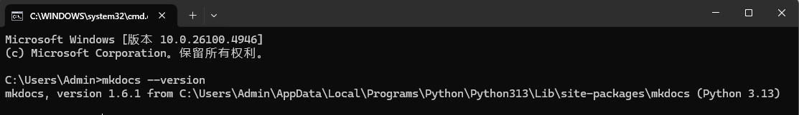
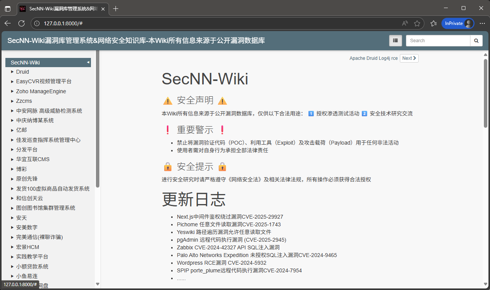
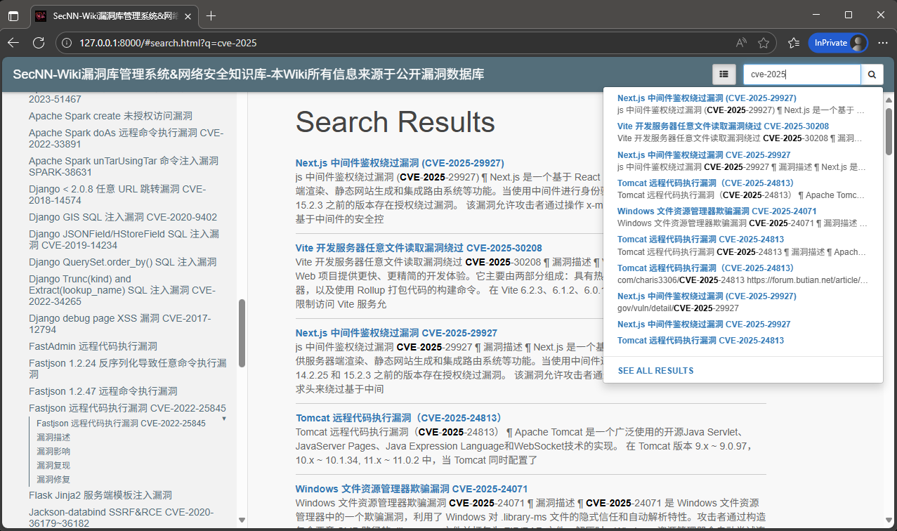
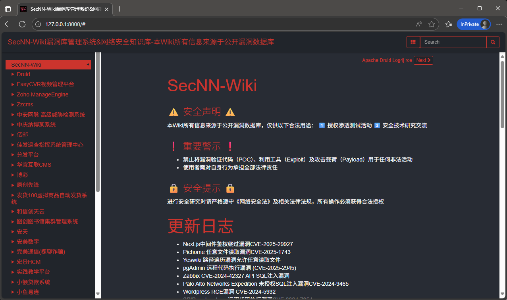

# SecNN-Wiki漏洞库管理系统&网络安全知识库-本Wiki所有信息来源于公开漏洞数据库

常见漏洞知识库文档

在线阅读：https://www.secnn.com/POC-EXP/index.html

#### ⚠️ 安全声明 ⚠️ 

本Wiki所有信息来源于公开漏洞数据库仅供合法用途： 

1️⃣ 授权渗透测试 

2️⃣ 安全技术研究交流与学习

#### ❗️ 重要警示 ❗️

- 禁止将漏洞验证代码（POC）、利用工具（Exploit）及攻击载荷（Payload）用于任何非法活动。
- 使用者需对自身行为承担全部法律责任。

#### 🔒 安全提示 🔒

 进行安全研究时请严格遵守《网络安全法》及相关法律法规，所有操作必须获得合法授权。

## 介绍

本文档旨在系统性地整理已识别的安全漏洞，为安全开发团队提供高效查阅和修复的参考依据。

文档涵盖主要安全风险领域，包括：

1. Web应用层漏洞
2. 中间件安全缺陷
3. 系统配置不当
4. 移动端（Android）安全问题
5. 网络设备及IOT安全

每类漏洞提供以下核心信息：

- 漏洞详细说明
- 典型应用场景分析
- 修复方案与建议

版权声明： 内容由作者整理撰写，参考资料来源于公开网络资源。如涉及任何版权问题，请及时联系作者进行删除处理。

## 更新日志

* Next.js中间件鉴权绕过漏洞CVE-2025-29927
* Pichome 任意文件读取漏洞CVE-2025-1743
* Yeswiki 路径遍历漏洞允许任意读取文件
* pgAdmin 远程代码执行漏洞 (CVE-2025-2945)
* Zabbix CVE-2024-42327 API SQL注入漏洞
* Palo Alto Networks Expedition 未授权SQL注入漏洞CVE-2024-9465
* Wordpress RCE漏洞 CVE-2024-5932
* SPIP porte_plume远程代码执行漏洞CVE-2024-7954
* ......

## 安装MkDocs

**MkDocs** 是一个 **快速、简单、优雅的静态网站生成器**，专门用于 **构建项目文档**。它使用 **Markdown** 编写内容，通过简单的 YAML 配置，快速生成美观、可部署的静态 HTML 网站。

使用PIP安装MkDocs包：

```
pip install mkdocs
```

检查安装是否完成：

```
mkdocs --version
```



#### 启动服务器：

```
cd SecNN-Wiki
mkdocs serve
或
mkdocs serve -a 192.168.1.112:9999 #自定义端口
```

在浏览器中打开http://127.0.0.1:8000/，默认端口:8080



#### 漏洞检索



#### 安装其他主题

```
pip install windmill-dark
```

若下载慢，可更换安装源为豆瓣

```
pip install --trusted-host pypi.douban.com -i http://pypi.douban.com/simple/ mkdocs windmill-dark
```



更多主题：https://github.com/mkdocs/mkdocs/wiki/MkDocs-Themes

使用 mkdocs 构建完成的文档

```
mkdocs build
```

默认情况下，将输出生成的文档到site目录。

## 感谢阅读-技术交流

扫描下方二维码，并在验证信息中说明来意，文章仅供交流学习,不承担任何有关责任!


## 声明

本项目收集漏洞均源于互联网：

https://github.com/eeeeeeeeee-code/POC

https://github.com/baisesecxxx/yougar0.github.io

https://github.com/Threekiii/Awesome-POC

https://github.com/PeiQi0/PeiQi-WIKI-Book

https://github.com/vulhub/vulhub

https://github.com/DMW11525708/wiki

https://github.com/w2n1ck/vulwiki

......
